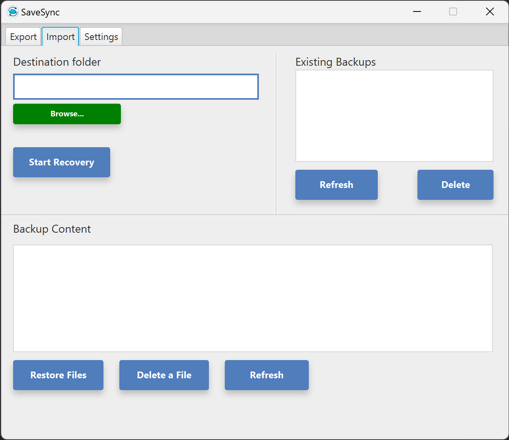
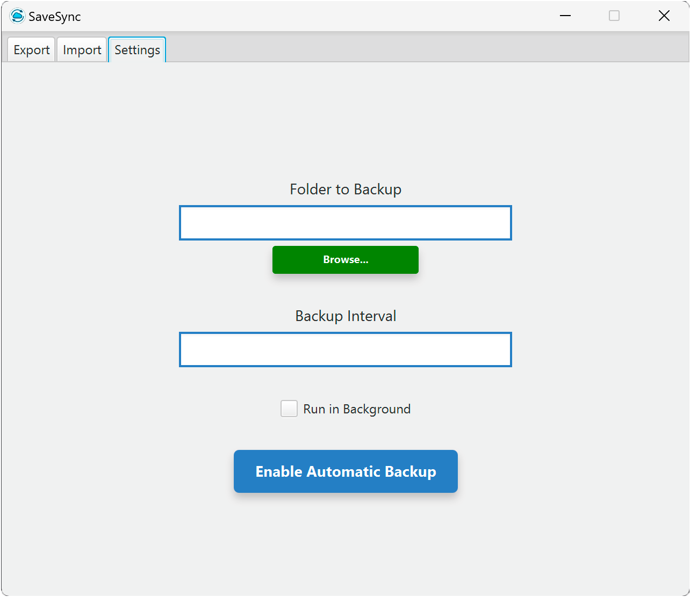

# SaveSync - Client

## Description
This module is the client part of the offsite backup application. Developed with JavaFX, this user interface allows users to select folders to backup, configure connection settings to the backup server, and initiate the backup process. The client is built using Java for its portability across operating systems and support for polymorphism, enhancing scalability and maintenance of the code.


## Technical Description

The SaveSync client is designed using a MVC (Model-View-Controller) architectural pattern to organize the code, separating responsibilities into different components: UserAuthView for user authentication and FileBackupView for backup management. This separation ensures better code maintainability and ease of adding new features.

### Features

The client application allows users to:
- Connect to the server via SSL sockets, ensuring secure communications.
- Select and backup folders on the server.
- Retrieve previous backups.
- Manage backup versions with advanced features.
- Automatic Backups : Users can configure the application to automatically backup selected folders at regular intervals.
  This ensures that your data is regularly backed up without the need for manual intervention.

## Quick Start

### Installation

#### Prerequisites

- **Java Development Kit (JDK):** This program requires Java JDK 21. Ensure Java is installed on your system and that the JAVA_HOME environment variable points to your JDK 21 installation.

- **Docker:** Docker is necessary for running the LDAP service for authentication. If not already installed, download and start the Docker service on your machine.

#### Clone the Git repository
```
git clone https://github.com/SaveSync-App/Client.git
```

#### Launching the Client Application

Open your IDE and launch the client application or use the .jar file to start the SaveSync client graphical interface.

#### Server Connection

Upon application launch, users are prompted to connect to the backup server by entering the server's IP address, username, and password. Authentication is performed via an SSL socket, with the server validating credentials against the LDAP directory.

To quickly launch the server for testing SaveSync, follow these steps:

1. **Clone the Server Repository:** Obtain the server code by cloning its repository.
    ```
    git clone https://github.com/SaveSync-App/Server.git
    ```

2. **Launch with Docker Compose:** Navigate to the root of the cloned server project and run:
    ```   
    docker-compose up -d
    ```

3. **Run the Server Application:** Start the server application to listen for client connections.


#### Selecting Folders to Backup

Users select folders for backup through a `DirectoryChooser`. Once a folder is selected, initiating the backup process sends files to the server via an SSL socket, with backups tagged with date and time information.


#### Backup Recovery
The "Start Recovery" button allows users to retrieve backups. Users choose a destination folder and a specific backup for recovery, with the option to restore the entire backup or select individual files. This flexible recovery process, secured via an SSL socket, ensures precise and tailored restoration.



#### Automatic Backups Setup 

Users can set the application to perform automatic backups of selected folders at predetermined intervals, ensuring regular data protection without manual intervention. Additionally, selecting "Run in Background" minimizes the application to the system tray for uninterrupted operation, allowing scheduled backups to continue even when the main window is closed.


